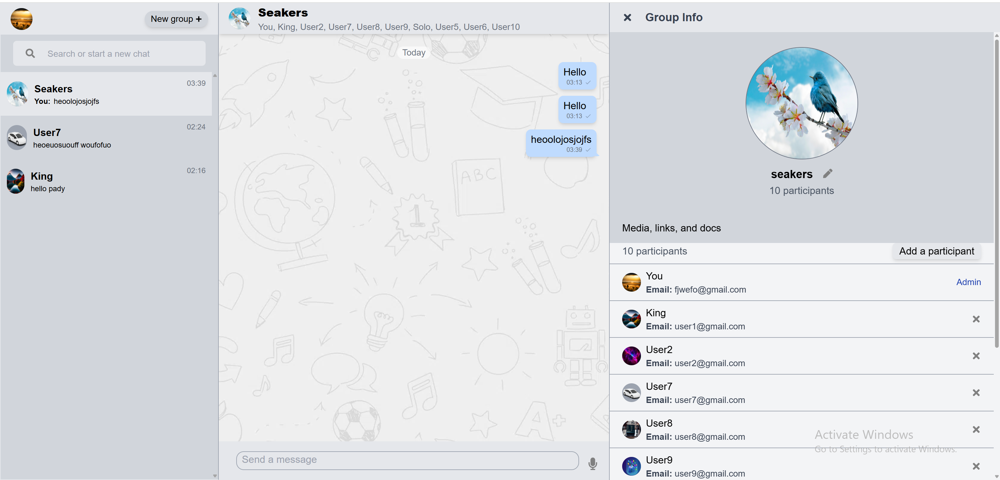

# ChatApp

A fast, secure, and seamless real-time chat application for groups, friends, and anyone you can connect with via email or username.

[Live Demo](https://chatapp-amber-rho.vercel.app)

---

## 🚀 Overview

**ChatApp** solves the problem of losing contact with friends or colleagues by allowing you to reconnect and chat instantly if you know their email or username. Designed for both group and individual conversations, it ensures privacy, security, and a smooth user experience.  
The app is highly responsive, easy to navigate, and perfect for all groups of people.

---

## ✨ Features

- **Real-time Messaging:** Instant chat updates using Socket.IO.
- **Typing Indicators:** See when others are typing.
- **Group & Individual Chats:** Create groups or chat one-on-one.
- **Notifications:** Stay updated with real-time notifications.
- **Group Management:** Only admins can add or remove members.
- **Chat Info:** View details about groups or individuals.
- **Authentication:** Secure sign up and sign in with JWT.
- **Responsive UI:** Built with Tailwind CSS for all devices.
- **Cloudinary Integration:** For media and file uploads.
- **Clear, Readable Code:** Ideal for teamwork and future improvements.

---

## 🛠️ Tech Stack

- **Frontend:** React.js, Redux, Tailwind CSS
- **Backend:** Node.js, Express.js
- **Database:** MongoDB (Atlas)
- **Real-time:** Socket.IO
- **Media Storage:** Cloudinary
- **Authentication:** JWT (JSON Web Token)

---

## 📦 Getting Started

### Prerequisites

- Node.js & npm/yarn
- MongoDB Atlas account (or local MongoDB)
- Cloudinary account

### Installation

1. **Clone the repository:**

   ```bash
   git clone https://github.com/billboah/ChatApp.git
   cd ChatApp
   ```

2. **Set up environment variables:**

   Create a `.env` file in `chat-server/` with the following:

   ```
   JWT_SECRET=your_jwt_secret
   MONGO_URI=your_mongodb_uri
   FRONTEND_URL=http://localhost:3000
   PORT=5000
   ```

3. **Install dependencies:**

   ```bash
   cd chat-server
   npm install
   cd ../chat-app
   npm install
   ```

4. **Run the app:**

   - Start backend:
     ```bash
     cd chat-server
     npm start
     ```
   - Start frontend:
     ```bash
     cd ../chat-app
     npm start
     ```

5. **Visit:**  
   [http://localhost:3000](http://localhost:3000)

---

## 🧑‍💻 Contribution

- Code is clean and readable—ideal for group work and open source contributions.
- Pull requests and suggestions are welcome!

---

## ⚙️ Environment Variables

| Variable     | Description                   |
| ------------ | ----------------------------- |
| JWT_SECRET   | Secret for JWT authentication |
| MONGO_URI    | MongoDB connection string     |
| FRONTEND_URL | Frontend base URL             |
| PORT         | Backend server port           |

---

## 📸 Screenshots



---

## 📄 License

© 2025 Billboah. All rights reserved.  
This project is proprietary and not licensed for redistribution or commercial use without permission.

---

## 📬 Contact

For questions, feedback, or collaboration, contact wyeboah618@gmail.com .

---
