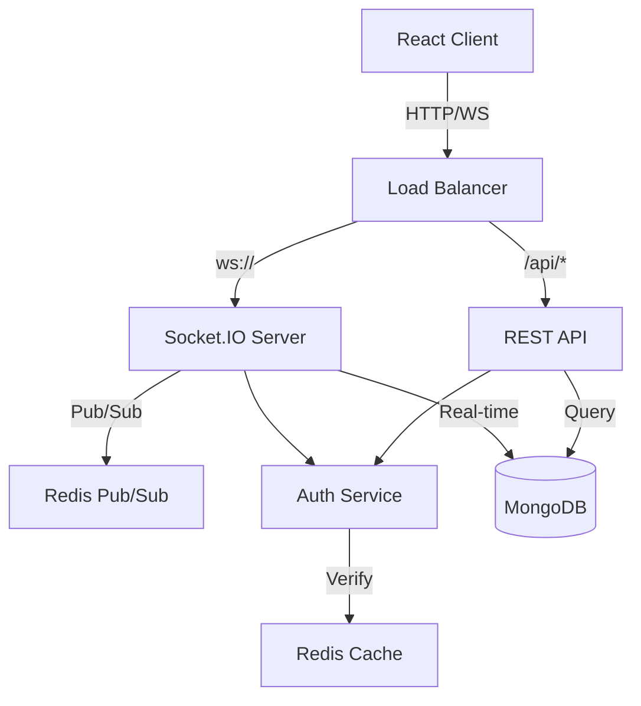
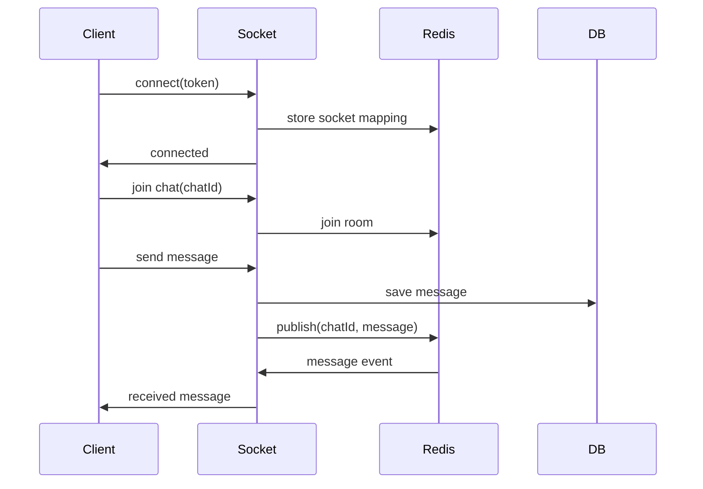

# ChatApp Backend Technical Architecture

A high-performance Node.js backend implementing real-time messaging, sophisticated caching, and optimized database queries. Built with TypeScript, Express, Socket.IO, and MongoDB.



## System Architecture Overview

The backend implements a scalable real-time chat system with:

- JWT-based authentication
- Socket.IO for real-time messaging
- MongoDB for persistent storage
- Redis for pub/sub and caching (optional)
- TypeScript for type safety

## Database Design

### Core Collections & Relationships

```typescript
// User Collection
interface User {
  _id: ObjectId;
  email: string; // Indexed, unique
  username: string; // Indexed, unique
  passwordHash: string; // bcrypt(password, 12)
  avatar?: string; // Cloudinary URL
  lastSeen: Date; // Updated on disconnect
  socketId?: string; // Current socket connection

  // Virtuals
  isOnline: boolean; // Computed from lastSeen
}

// Chat Collection
interface Chat {
  _id: ObjectId;
  chatName?: string; // For group chats
  isGroupChat: boolean; // Single vs Group chat
  users: ObjectId[]; // Indexed, array of User._id
  groupAdmin?: ObjectId; // User._id of group creator
  latestMessage?: ObjectId; // Message._id

  // Unread tracking per user
  unreadCounts: {
    userId: ObjectId;
    count: number;
    lastRead: Date;
  }[];
}

// Message Collection
interface Message {
  _id: ObjectId;
  sender: ObjectId; // User._id
  content: string; // Message text
  chat: ObjectId; // Chat._id, indexed
  readBy: ObjectId[]; // Array of User._id

  // Metadata
  createdAt: Date;
  updatedAt: Date;
  deletedAt?: Date; // Soft delete support
}
```

### Key Indexes

```javascript
// Users
db.users.createIndex({ email: 1 }, { unique: true });
db.users.createIndex({ username: 1 }, { unique: true });
db.users.createIndex({ lastSeen: 1 }); // Online status queries

// Chats
db.chats.createIndex({ users: 1 }); // Find user's chats
db.chats.createIndex({ "unreadCounts.userId": 1 }); // Unread tracking
db.chats.createIndex({ users: 1, updatedAt: -1 }); // Chat list with sorting

// Messages
db.messages.createIndex({ chat: 1, createdAt: -1 }); // Chat history + pagination
db.messages.createIndex({ sender: 1, chat: 1 }); // User message lookups
```

## Real-time Architecture



### Socket Event Flow

1. **Connection & Authentication**

```typescript
// socket/chatSocket.ts
io.use(async (socket, next) => {
  try {
    const token = socket.handshake.auth.token;
    const decoded = jwt.verify(token, JWT_SECRET);

    // Get full user data
    const user = await User.findById(decoded.id).select("-password");

    // Attach to socket
    socket.user = user;
    next();
  } catch (err) {
    next(new Error("Authentication failed"));
  }
});
```

2. **Chat Room Management**

```typescript
// Join chat room
socket.on("join chat", async (chatId) => {
  socket.join(chatId);

  // Track active rooms
  socket.activeRoom = chatId;

  // Notify others
  socket.to(chatId).emit("user joined", {
    user: socket.user,
    chatId,
  });
});
```

3. **Message Broadcasting**

````typescript
// Broadcast new message
socket.on('send message', async (data) => {
  const { content, chatId } = data

  // Save to DB
  const message = await Message.create({
    sender: socket.user._id,
    content,
    chat: chatId
  })

  // Broadcast to room
  io.to(chatId).emit('received message', {
    message,
    user: socket.user
  })

  // Update chat's latestMessage
  await Chat.findByIdAndUpdate(chatId, {
    latestMessage: message._id
  })
})

## Performance Optimizations

### Database Query Optimization

1. **Efficient Chat List Query**
```typescript
const chats = await Chat.aggregate([
  // Match user's chats
  { $match: { users: userId }},

  // Latest message lookup
  { $lookup: {
    from: 'messages',
    localField: 'latestMessage',
    foreignField: '_id',
    as: 'lastMsg'
  }},

  // User details lookup
  { $lookup: {
    from: 'users',
    localField: 'users',
    foreignField: '_id',
    as: 'users'
  }},

  // Optimize fields
  { $project: {
    chatName: 1,
    isGroupChat: 1,
    users: { $map: {
      input: '$users',
      as: 'user',
      in: {
        _id: '$$user._id',
        username: '$$user.username',
        email: '$$user.email'
      }
    }},
    latestMessage: { $first: '$lastMsg' }
  }}
])
````

2. **Paginated Message History**

```typescript
const messages = await Message.find({
  chat: chatId,
  createdAt: { $lt: cursor },
})
  .sort({ createdAt: -1 })
  .limit(20)
  .populate("sender", "username email")
  .lean();
```

### Caching Strategy

1. **User Session Cache**

```typescript
// Redis cache for active users
const userCache = new Redis({
  keyPrefix: "user:",
  ttl: 3600, // 1 hour
});

// Cache user on login
async function cacheUser(userId: string, userData: any) {
  await userCache.set(userId, JSON.stringify(userData));
}

// Get cached user
async function getCachedUser(userId: string) {
  const cached = await userCache.get(userId);
  return cached ? JSON.parse(cached) : null;
}
```

2. **Chat Room Member Cache**

````typescript
// Cache chat members for quick access
const roomCache = new Redis({
  keyPrefix: 'room:',
  ttl: 3600
})

async function cacheRoomMembers(
  chatId: string,
  members: string[]
) {
  await roomCache.set(
    chatId,
    JSON.stringify(members)
  )
}

## Security Implementation

### Authentication Flow
```mermaid
sequenceDiagram
    participant Client
    participant API
    participant JWT
    participant DB

    Client->>API: POST /login
    API->>DB: verify credentials
    DB->>API: user data
    API->>JWT: generate token
    JWT->>API: signed token
    API->>Client: token + user
````

### Request Validation

```typescript
// middleware/validate.ts
const validateChat = [
  body("users").isArray(),
  body("chatName").optional().isString().trim().escape(),
  body("isGroupChat").optional().isBoolean(),

  async (req: Request, res: Response, next: NextFunction) => {
    const errors = validationResult(req);
    if (!errors.isEmpty()) {
      return res.status(400).json({
        errors: errors.array(),
      });
    }
    next();
  },
];
```

### Rate Limiting

````typescript
// middleware/rateLimit.ts
const messageLimiter = rateLimit({
  windowMs: 60 * 1000, // 1 minute
  max: 60, // 60 messages per minute
  message: 'Too many messages, please wait'
})

const loginLimiter = rateLimit({
  windowMs: 15 * 60 * 1000, // 15 minutes
  max: 5, // 5 failed attempts
  skipSuccessfulRequests: true
})

## API Documentation

### Authentication Endpoints
```http
POST /api/user/login
Content-Type: application/json

{
  "email": "user@example.com",
  "password": "password123"
}

Response 200:
{
  "token": "jwt.token.here",
  "user": {
    "_id": "user_id",
    "email": "user@example.com",
    "username": "username"
  }
}
````

### Chat Operations

```http
POST /api/chat
Authorization: Bearer <token>
Content-Type: application/json

{
  "userId": "target_user_id"
}

Response 200:
{
  "_id": "chat_id",
  "users": [{user object}],
  "isGroupChat": false,
  "latestMessage": null
}
```

### Message Operations

```http
GET /api/message/:chatId
Authorization: Bearer <token>
Query params:
  - before: Date (pagination cursor)
  - limit: number (default 20)

Response 200:
{
  "messages": [{
    "_id": "message_id",
    "sender": {user object},
    "content": "message text",
    "chat": "chat_id",
    "createdAt": "timestamp"
  }],
  "hasMore": boolean
}
```

### Group Chat Operations

```http
POST /api/chat/group
Authorization: Bearer <token>
Content-Type: application/json

{
  "users": ["user_id1", "user_id2"],
  "chatName": "Group Name"
}

Response 200:
{
  "_id": "group_id",
  "chatName": "Group Name",
  "isGroupChat": true,
  "users": [{user objects}],
  "groupAdmin": "creator_id"
}
```

## Error Handling & Monitoring

### Global Error Handler

```typescript
// middleware/error.ts
interface AppError extends Error {
  statusCode?: number;
  data?: any;
}

const errorHandler = (
  err: AppError,
  req: Request,
  res: Response,
  next: NextFunction
) => {
  const status = err.statusCode || 500;
  const message = err.message || "Internal server error";

  // Log error
  console.error(`[${req.method}] ${req.path} =>`, err);

  res.status(status).json({
    error: {
      message,
      ...(process.env.NODE_ENV === "development" && {
        stack: err.stack,
        data: err.data,
      }),
    },
  });
};
```

### Socket Monitoring

```typescript
// Track socket metrics
const metrics = {
  connections: 0,
  messagesSent: 0,
  errors: 0,
};

io.on("connection", (socket) => {
  metrics.connections++;

  socket.on("disconnect", () => {
    metrics.connections--;
  });

  socket.on("error", () => {
    metrics.errors++;
  });
});

// Expose metrics endpoint
app.get("/metrics", (req, res) => {
  res.json(metrics);
});
```

### Activity Logging

````typescript
// middleware/logger.ts
const logger = winston.createLogger({
  format: winston.format.combine(
    winston.format.timestamp(),
    winston.format.json()
  ),
  transports: [
    new winston.transports.File({
      filename: 'error.log',
      level: 'error'
    }),
    new winston.transports.File({
      filename: 'combined.log'
    })
  ]
})

// Log socket events
io.on('connection', socket => {
  logger.info('Socket connected', {
    socketId: socket.id,
    userId: socket.user?._id
  })

  socket.on('send message', data => {
    logger.info('Message sent', {
      socketId: socket.id,
      userId: socket.user?._id,
      chatId: data.chatId
    })
  })
})

Authentication handshake detail:

- Send your JWT in the handshake auth payload (e.g. `auth: { token }`). The server verifies the token and then loads the user document from DB. The server expects the token to contain an `id` field (created by `generateToken`).

## Testing Strategy

### Unit Tests
```typescript
// __tests__/auth.test.ts
describe('Authentication', () => {
  it('should validate user credentials', async () => {
    const user = {
      email: 'test@test.com',
      password: 'password123'
    }

    const res = await request(app)
      .post('/api/user/login')
      .send(user)

    expect(res.status).toBe(200)
    expect(res.body).toHaveProperty('token')
  })
})
````

### Socket Tests

```typescript
// __tests__/socket.test.ts
describe('Socket Events', () => {
  let clientSocket, serverSocket

  beforeAll((done) => {
    // Setup test server
    const io = new Server()
    clientSocket = Client(`http://localhost:${port}`)

    io.on('connection', (socket) => {
      serverSocket = socket
    })

    clientSocket.on('connect', done)
  })

  it('should handle message events', (done) => {
    clientSocket.emit('send message', {
      content: 'test',
      chatId: 'test-chat'
    })

    serverSocket.on('received message', (data) => {
      expect(data).toHaveProperty('content', 'test')
      done()
    })
  })
})

## Development notes & troubleshooting

- The JWT token generated by `config/generateToken.ts` currently signs `{ id }`. This is intentional: a small token reduces exposure if leaked. The socket auth middleware resolves that `id` to a full user document at connection time. If you prefer tokens to include `_id` or extra fields, update `generateToken.ts` and the auth middleware accordingly.

- If you see errors during socket connection like `Invalid token` or `Authentication token missing`:

  - Verify the client sends the token correctly in `socket.handshake.auth.token`.
  - Ensure `JWT_SECRET` in `.env` matches the secret used to generate tokens.

- If MongoDB connection fails, ensure `MONGO_URI` is correct and the DB is reachable.

- For production deployments:
  - Use a process manager (PM2, systemd) or container orchestration.
  - Use a shared session/caching store (Redis) if you run multiple socket servers behind a load balancer. Consider using Redis to share socket-user mappings or to cache user lookups performed at handshake time.

## Next steps & optional improvements

- Add Redis caching for user lookups during socket handshake for horizontal scaling.
- Implement token revocation or short-lived tokens + refresh tokens if you need immediate logout capability.
- Add tests for socket handlers and REST routes (there are dev deps like `supertest` and `jest` available).

## Where to look in source

- Server entry: `server.ts`
- Socket handlers: `sockets/chatSocket.ts`
- Authentication middleware: `middleware/authMiddleware.ts`
- Token generator: `config/generateToken.ts`
- DB connection: `config/db.ts`
- Routes: `routes/*`

<!-- Optional follow-ups were previously listed here. Follow-ups were implemented or are available on request. -->
```
